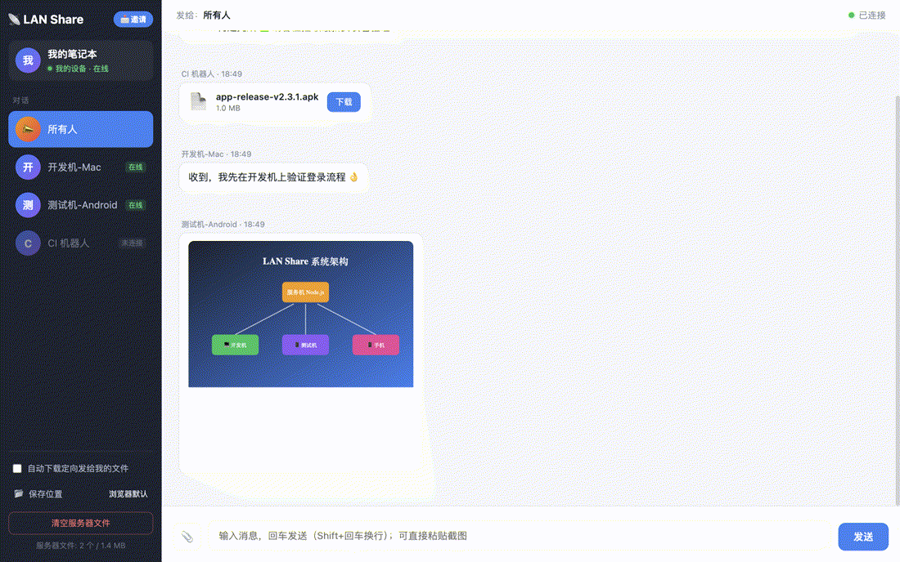
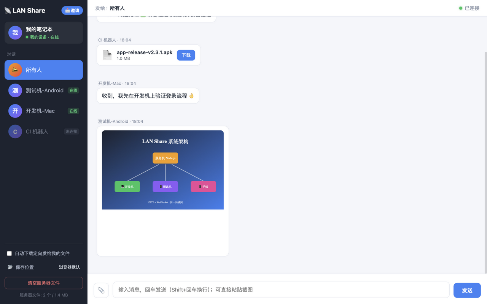
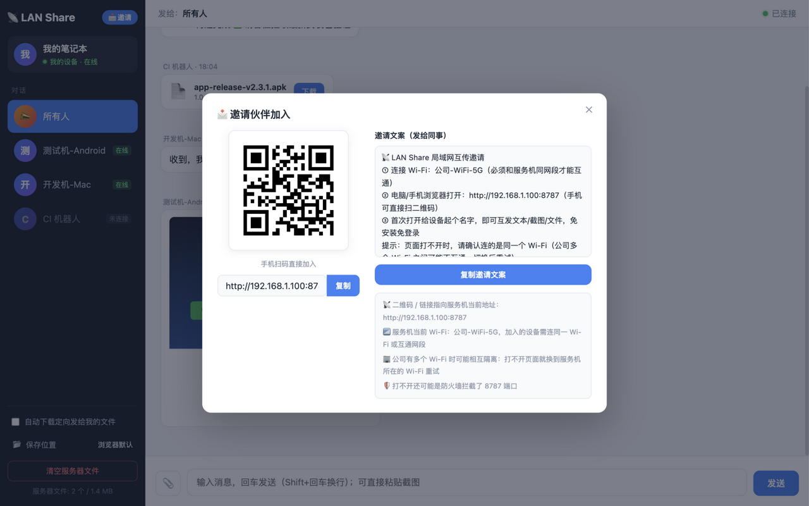
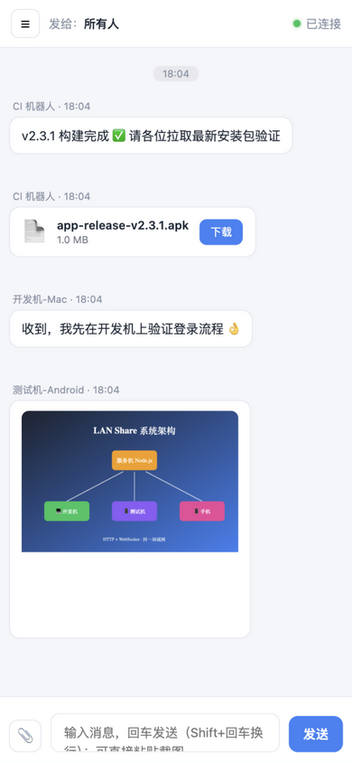
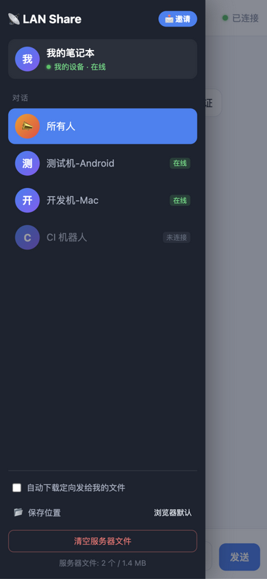

# LAN Share 📡

English | [简体中文](README.zh-CN.md)

**LAN file & message sharing for teams.** Start the server on one machine, and every device on the LAN — Windows, macOS, Linux, phones — shares text, screenshots and files right from the browser.

**Zero install for receivers. No accounts. Data never leaves your network.**



| Main UI | Invite |
|---|---|
|  |  |

| Mobile chat | Mobile drawer |
|---|---|
|  |  |

> UI is currently Chinese-only. An i18n layer is planned — PRs welcome!

## Why LAN Share

Most LAN transfer tools (LocalSend, Snapdrop…) require installing an app on every device. LAN Share flips that: **the receiver only needs a browser** — perfect for test benches, CI rigs and mixed-OS teams.

- 🖥️ **Receiver = browser**: scan a QR code, start sharing. Nothing to install
- 🤖 **Built for unattended test machines & CI**: push build artifacts over HTTP, devices auto-download them to a folder
- 💬 **Conversation-style messaging**: broadcast channel + per-device private chats, unread badges, quote replies, 2-minute recall, drafts
- 📎 **Files & screenshots**: paste screenshots, drag & drop, streaming transfer (no size limit), in-page image lightbox
- 🧩 **Script-friendly HTTP API**: one-line `curl` to push files
- 📱 **Mobile-ready UI** and invite QR codes
- 🔒 Optional PIN; everything stays on your LAN

## Quick Start

Requires Node.js ≥ 14

```bash
git clone https://github.com/lkyhahaha/lanshare.git
cd lanshare
npm install
node server.js
```

The terminal prints LAN URLs and a QR code. Other devices:

- Open `http://<server-ip>:8787` in a browser, or scan the QR
- Pick a device name in the welcome dialog (duplicates are rejected) and start sharing

> Pre-configure a test machine: `http://<ip>:8787/?name=TestMachineA`

### Download prebuilt binaries (no Node.js needed)

[Releases](https://github.com/lkyhahaha/lanshare/releases) ships single-file builds for Windows / macOS / Linux:

```bash
./lanshare --port=8787
```

### Docker

```bash
docker build -t lanshare .
docker run -d --name lanshare -p 8787:8787 -v lanshare-data:/app/data lanshare
```

### Options

```bash
node server.js [--port=8787] [--pin=1234] [--dir=./data]
```

| Option | Description | Default |
|---|---|---|
| `--port` | Listen port | 8787 |
| `--pin` | Require a PIN for web & API access | off |
| `--dir` | Data directory (files, device registry) | ./data |

## Usage

| Action | How |
|---|---|
| Switch conversation | Sidebar: "所有人" (Everyone) = broadcast channel; click a device for private chat |
| Unread | Red badge per conversation + `(n)` in the browser tab title |
| Send text | Enter to send (Shift+Enter for newline); IME-safe |
| Send screenshot | Ctrl/⌘ + V inside the page |
| Send files | 📎 button or drag & drop; streaming with progress bars |
| Quote reply | Hover a message → 引用 |
| Recall | Own messages, within 2 minutes |
| Auto-download | Toggle in the sidebar; files targeted at this device are saved automatically (Chrome/Edge can pick a folder) |
| Invite | "📩 邀请" button: QR + copyable invite text with Wi-Fi hints |
| Admin (server machine only) | "清空服务器文件" clears uploads; ✕ removes offline devices from the list |

## HTTP API

```bash
# Push a file (streaming, any size) — broadcast to everyone
curl -T app.apk "http://192.168.1.5:8787/api/files?to=all&fromName=CI"

# Non-ASCII filenames: use the x-filename header
curl -T 构建包.apk -H "x-filename: 构建包.apk" "http://192.168.1.5:8787/api/files?to=all"

# Target one device (deviceId from /api/devices)
curl -T app.apk "http://192.168.1.5:8787/api/files?to=<deviceId>&fromName=CI"

# List online devices & storage usage
curl http://192.168.1.5:8787/api/devices

# Send a text message
curl -X POST "http://192.168.1.5:8787/api/send-text" \
     -H 'Content-Type: application/json' \
     -d '{"text":"build done","to":"all","fromName":"CI"}'

# Download a file
curl -OJ "http://192.168.1.5:8787/files/<fileId>"

# Clear server files (admin, server machine only)
curl -X DELETE http://localhost:8787/api/files
```

With `--pin`, add header `x-pin: <PIN>` or `?pin=<PIN>` to every API call.

## FAQ

**Page won't open?**
1. Make sure the device is on the **same Wi-Fi / subnet** as the server (corporate SSIDs are often isolated)
2. Check the server firewall allows the port (default 8787)
3. Server IP changed (different network) — use the address printed at startup

**Files stored where? Lost on restart?**
Server `--dir` (default `./data`). Files survive restarts; admins can clear them from the page.

## Security

Designed for **trusted LANs**: plain HTTP/WS, no accounts. Do not expose it to the internet. Use `--pin` if your LAN isn't fully trusted. Admin actions (clear files, remove devices) are restricted to the server machine.

## Project Layout

```
├── server.js          # entry: HTTP + WebSocket, static UI, REST API
├── lib/
│   ├── hub.js         # connection & message hub: registry, routing, recall, history
│   ├── files.js       # streaming file store
│   ├── qrsvg.js       # QR code (SVG) generator
│   └── util.js        # helpers
├── public/            # frontend single page (vanilla HTML/JS/CSS, no build step)
└── data/              # runtime data (auto-created, gitignored)
```

## License

[MIT](LICENSE)
